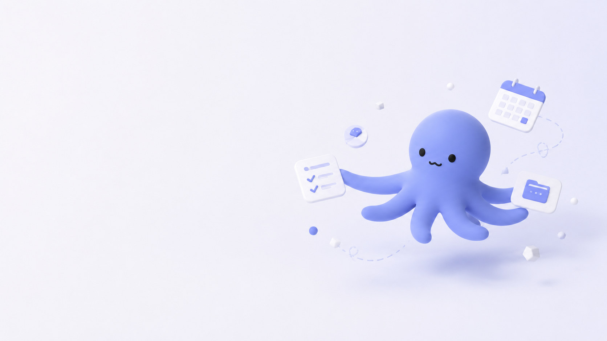
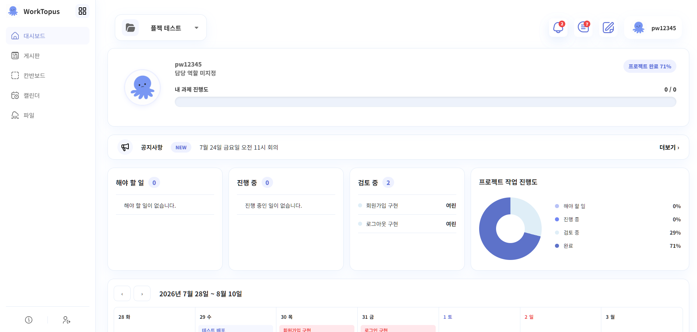
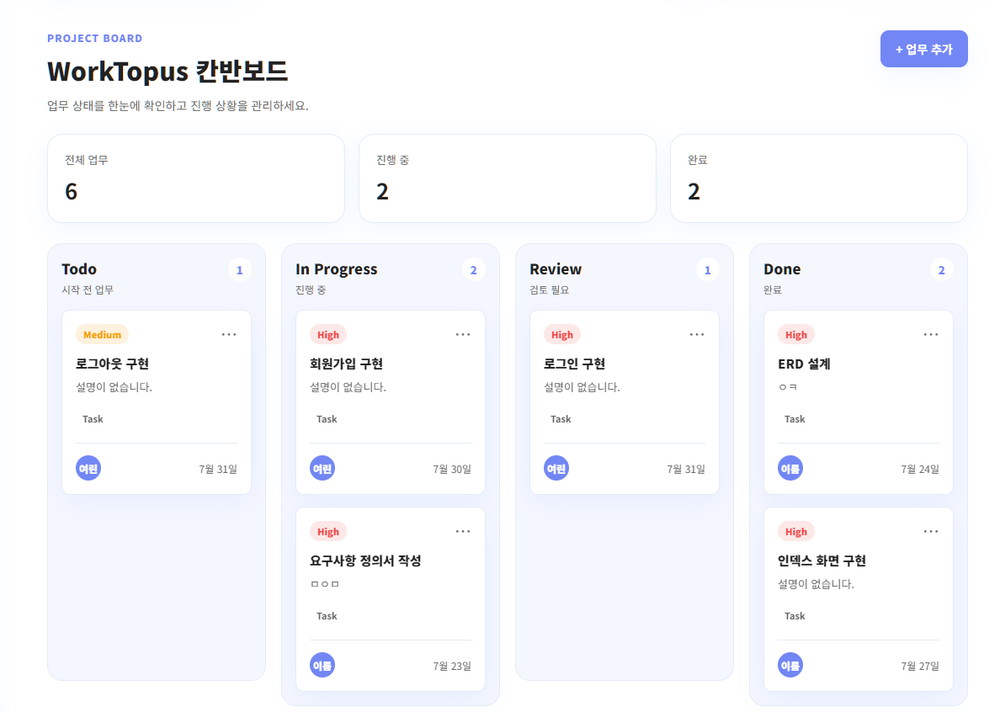
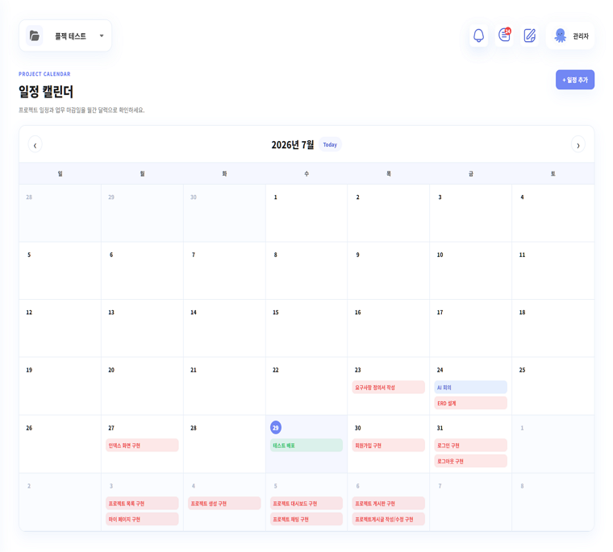
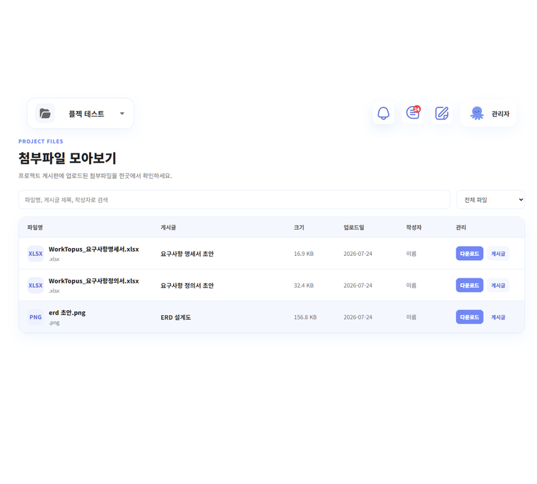
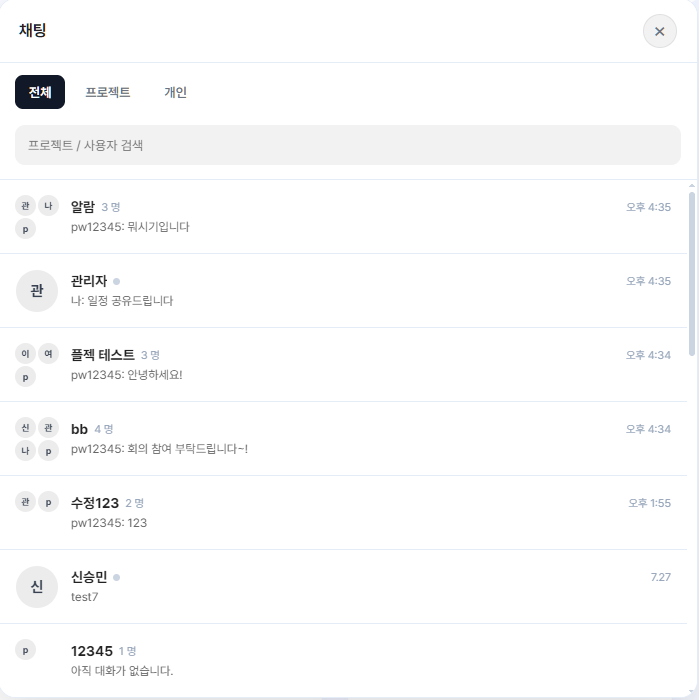
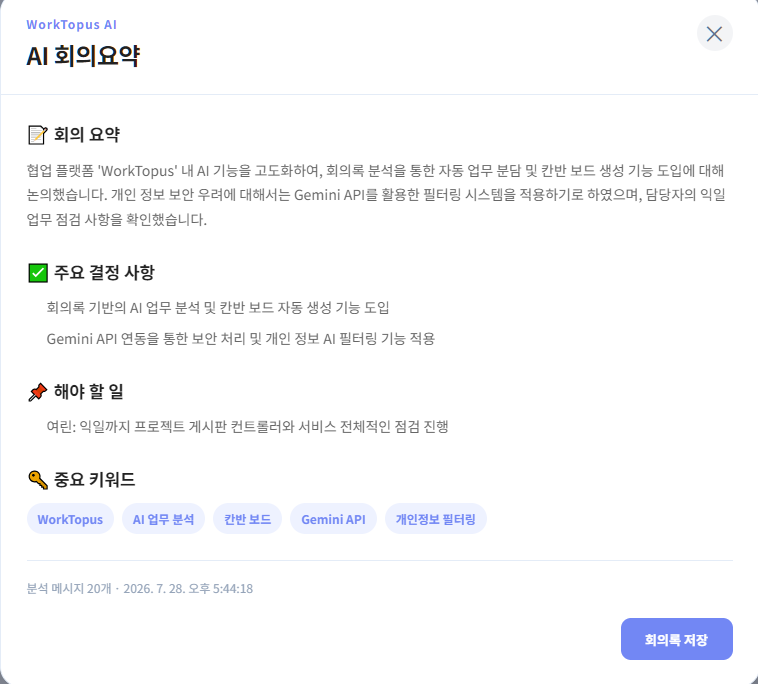
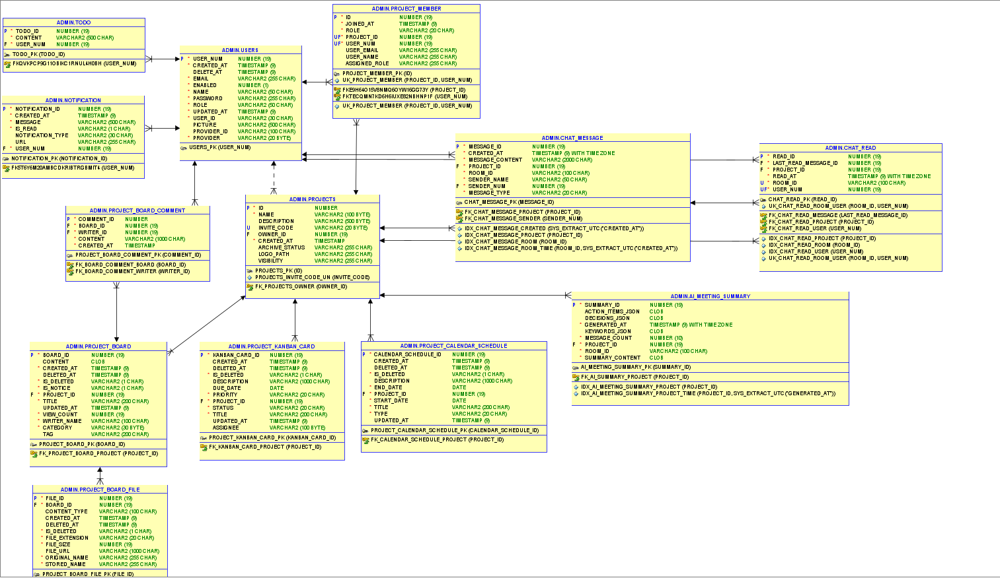
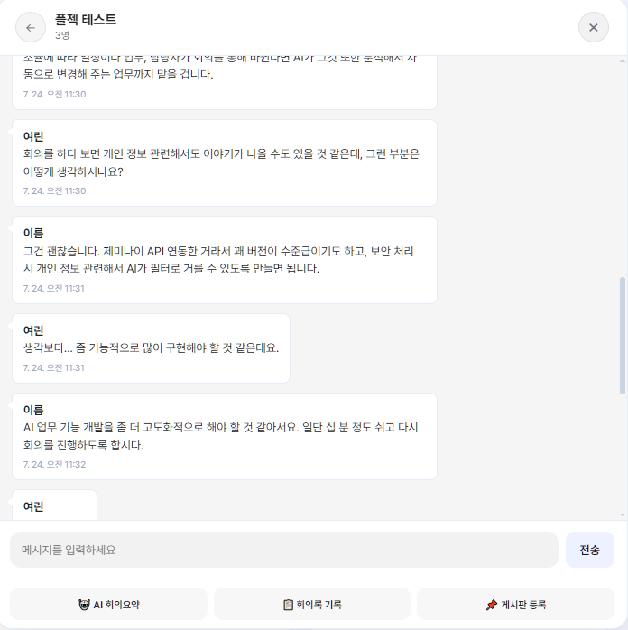

<div align="center">

 #  WorkTopus

### 프로젝트 협업에 필요한 모든 기능을 하나의 워크스페이스에서

게시판 · 칸반 · 일정 관리 · 파일 공유 · 실시간 채팅 · AI 회의 요약까지  
**프로젝트 협업에 필요한 기능을 하나의 플랫폼에서 제공합니다.**

<br>



<br>


</div>

---

# 📌 프로젝트 소개

> **WorkTopus는 프로젝트 협업에 필요한 기능을 하나의 공간으로 통합한 웹 기반 협업 플랫폼입니다.**

프로젝트를 진행하다 보면 업무는 칸반에서, 일정은 캘린더에서, 자료는 게시판에서, 소통은 메신저에서 이루어지는 경우가 많습니다. 여러 서비스를 오가며 협업하는 과정은 불편할 뿐만 아니라 프로젝트 기록이 분산되어 관리가 어려워지는 문제도 발생합니다.

**WorkTopus**는 이러한 불편함을 해결하기 위해 **프로젝트별 워크스페이스**를 중심으로 게시판, 칸반 보드, 일정 관리, 파일 공유, 실시간 채팅, AI 회의 요약 기능을 하나의 플랫폼으로 통합했습니다.

팀원들은 하나의 프로젝트 공간에서 업무를 관리하고, 자료를 공유하며, 실시간으로 소통할 수 있어 협업 과정 전체를 더욱 효율적으로 관리할 수 있습니다.

---

# 🎯 Why WorkTopus?

<div align="center">

| 기존 협업 방식 | WorkTopus |
|:---:|:---:|
| 📋 업무 관리 | ✅ 하나의 프로젝트 공간 |
| 📅 일정 관리 | ✅ 프로젝트별 일정 공유 |
| 📁 자료 공유 | ✅ 파일 통합 관리 |
| 💬 메신저 | ✅ 실시간 프로젝트 채팅 |
| 📝 회의록 | ✅ AI 회의 요약 |

</div>

프로젝트 진행에 필요한 기능을 하나의 플랫폼으로 통합하여 **업무 관리와 협업 흐름이 끊기지 않는 환경**을 제공하는 것을 목표로 개발했습니다.

---

# ✨ 핵심 기능

<table>

<tr>

<td width="50%" valign="top">

## 📊 프로젝트 대시보드

프로젝트 진행 상황과 개인 업무 현황을 한눈에 확인할 수 있는 메인 화면입니다.

✔ 프로젝트 진행률 제공  
✔ 게시글 · 파일 · 칸반 통계  
✔ 개인 업무 진행 현황  
✔ 프로젝트 구성원 정보

</td>

<td width="50%">



</td>

</tr>

<tr>

<td width="50%" valign="top">

## 📋 프로젝트 게시판

프로젝트에서 발생하는 공지사항, 업무, 회의록, 자료를 카테고리별로 관리할 수 있습니다.

공지 기능을 통해 중요한 내용을 공유하고 댓글과 첨부파일을 활용하여 협업 기록을 관리할 수 있습니다.

</td>

<td width="50%">


</td>

</tr>

<tr>

<td width="50%" valign="top">

## 📌 칸반 보드

업무를 단계별로 관리하고 프로젝트 진행 상황을 직관적으로 확인할 수 있습니다.

✔ Drag & Drop 지원

✔ 담당자 지정

✔ 우선순위 관리

✔ 마감일 관리

</td>

<td width="50%">



</td>

</tr>

<tr>

<td width="50%" valign="top">

## 📅 일정 관리

프로젝트 일정을 등록하고 팀원들과 공유할 수 있습니다.

월간 캘린더를 기반으로 프로젝트 일정을 조회하고 수정할 수 있으며 프로젝트별 일정 관리가 가능합니다.

</td>

<td width="50%">



</td>

</tr>

<tr>

<td width="50%" valign="top">

## 📁 파일 관리

프로젝트에서 사용하는 파일을 업로드하고 다운로드할 수 있습니다.

프로젝트별 파일을 안전하게 관리할 수 있도록 구현했습니다.

</td>

<td width="50%">



</td>

</tr>

<tr>

<td width="50%" valign="top">

## 💬 실시간 채팅

프로젝트 구성원 간 실시간으로 의견을 공유할 수 있습니다.

WebSocket 기반 실시간 통신을 통해 프로젝트별 채팅 기능을 제공합니다.

</td>

<td width="50%">



</td>

</tr>

<tr>

<td width="50%" valign="top">

## 🤖 AI 회의 요약

회의 내용을 Gemini AI가 분석하여 핵심 내용과 결정 사항을 자동으로 정리합니다.

회의 기록을 빠르게 공유하고 프로젝트 문서로 활용할 수 있습니다.

</td>

<td width="50%">



</td>

</tr>

</table>

---

# 🛠 Technology Stack

프로젝트의 목적과 기능에 맞추어 다음과 같은 기술을 활용하여 개발했습니다.

<br>

### Backend

<p>


</p>

### Frontend

<p>


</p>

### Database

<p>

</p>

### Communication & AI

<p>


</p>

### Collaboration

<p>


</p>

---

# 🏗 System Architecture

WorkTopus는 **계층형 아키텍처(Layered Architecture)**를 기반으로 설계하여 역할을 명확하게 분리하고 유지보수성과 확장성을 높였습니다.

```text
Client (Browser)
        │
        ▼
Spring Security
        │
        ▼
 Controller
        │
        ▼
   Service Layer
        │
 ┌──────┴────────┐
 ▼               ▼
JPA         WebSocket
 │               │
 ▼               ▼
Oracle ATP   Chat Server
        │
        ▼
 Gemini AI
```

### Architecture Overview

- **Spring Security**를 이용한 인증 및 권한 관리
- **Controller**에서 요청 및 응답 처리
- **Service Layer**에서 비즈니스 로직 수행
- **Spring Data JPA**를 통한 데이터 접근
- **Oracle ATP** 기반 데이터 저장
- **WebSocket**을 활용한 실시간 채팅
- **Gemini AI**를 이용한 회의 내용 요약

---

# 💡 Technical Highlights

프로젝트를 구현하면서 특히 중점을 두었던 기술적 요소입니다.

## 🔐 프로젝트 단위 권한 검증

단순히 로그인 여부만 확인하는 것이 아니라 프로젝트 구성원 여부를 함께 검증하여 프로젝트 외부 사용자의 접근을 차단했습니다.

- 프로젝트 멤버 검증
- 프로젝트 소유자 권한 검증
- 프로젝트별 데이터 접근 제한

---

## 📂 안전한 파일 저장 구조

업로드 파일을 프로젝트 내부가 아닌 외부 저장소에 저장하도록 설계했습니다.

이를 통해

- 프로젝트 소스와 업로드 파일 분리
- 운영 환경 대응
- 잘못된 업로드 경로 방지

를 구현했습니다.

---

## 📊 프로젝트 진행률 계산

칸반 카드 상태를 기반으로 프로젝트 진행률을 계산하고,

개인에게 할당된 업무를 별도로 집계하여 개인 진행 현황도 함께 제공합니다.

---

## ⚡ 실시간 협업

WebSocket 기반 채팅을 통해 프로젝트 구성원이 실시간으로 소통할 수 있도록 구현했습니다.

또한 AI 회의 요약 기능과 연계하여 회의 내용을 프로젝트 기록으로 활용할 수 있도록 구성했습니다.

---

# 🧩 Trouble Shooting

프로젝트를 진행하며 해결했던 주요 문제입니다.

<details>

<summary><strong>프로젝트별 권한을 어떻게 관리했나요?</strong></summary>

<br>

### Problem

동일한 서비스에서 여러 프로젝트가 운영되기 때문에,
사용자가 URL을 변경하여 다른 프로젝트의 데이터에 접근할 가능성이 있었습니다.

### Solution

프로젝트 ID만 검증하는 것이 아니라 로그인 사용자와 프로젝트 멤버 정보를 함께 확인하여 프로젝트 구성원만 접근할 수 있도록 설계했습니다.

또한 프로젝트 소유자(OWNER) 권한을 별도로 검증하여 프로젝트 관리 기능을 제한했습니다.

### Result

프로젝트별 데이터가 완전히 분리되었으며,
권한에 따라 접근 가능한 기능을 제어할 수 있게 되었습니다.

</details>

---

<details>

<summary><strong>Git 충돌을 어떻게 관리했나요?</strong></summary>

<br>

### Problem

5명의 팀원이 동시에 기능을 개발하면서 동일한 파일을 수정하는 경우가 많아 Merge Conflict가 자주 발생했습니다.

### Solution

Git Flow 전략을 적용하여 기능별 브랜치(feature)를 분리하고,
Pull Request와 코드 리뷰를 거친 후 develop 브랜치에 병합하는 방식으로 협업을 진행했습니다.

또한 기능 통합 전 develop 브랜치를 최신 상태로 유지하여 충돌을 최소화했습니다.

### Result

기능 개발과 통합 과정을 안정적으로 관리할 수 있었으며,
코드 충돌을 줄이고 협업 효율을 높일 수 있었습니다.

</details>

---

<details>

<summary><strong>실시간 협업</strong></summary>

<br>

Problem

프로젝트 구성원 간 소통이 즉각적으로 이루어지지 않으면 협업 효율이 떨어질 수 있었습니다.

Solution

WebSocket 기반 실시간 채팅 기능을 적용하여 메시지를 즉시 전달하도록 구현했습니다.

Result

프로젝트 내에서 빠른 의사소통이 가능해졌으며 협업 효율을 높일 수 있었습니다.

</details>

---

# 👥 Team

<div align="center">

| 이름 | 담당 영역 |
|:---:|:---|
| **김경규** | 회원 인증 및 사용자 관리, 로그인/회원가입 |
| **김여린** | 프로젝트 협업 기능(대시보드, 게시판, 칸반, 일정, 파일), 프로젝트 권한 관리 |
| **노희진** | 프로젝트 초대 및 멤버 관리, 이메일 초대 |
| **석가경** | 프로젝트 생성 및 관리, 프로젝트 목록, 초대 코드 |
| **신승민** | 실시간 채팅, AI 회의 요약 |

</div>

<br>

### 🤝 Collaboration

- Git Flow 전략을 기반으로 브랜치 운영
- Pull Request를 통한 코드 리뷰
- Notion을 활용한 일정 및 문서 관리
- Figma를 활용한 UI 설계
- 정기적인 코드 리뷰 및 기능 통합 회의 진행

---

# 🗺 Database (ERD)

<div align="center">



</div>

### 주요 도메인

- USER
- PROJECT
- PROJECT_MEMBER
- PROJECT_BOARD
- BOARD_COMMENT
- BOARD_FILE
- PROJECT_KANBAN_CARD
- PROJECT_CALENDAR_SCHEDULE
- CHAT_MESSAGE

---

# 📂 Project Structure

```text
WorkTopus
├── config
├── controller
├── service
│   └── impl
├── repository
├── entity
├── dto
├── security
├── websocket
├── ai
├── static
│   ├── css
│   ├── js
│   └── images
└── templates
```

프로젝트는 Spring Boot 기반의 계층형 구조를 적용하여 역할별 책임을 분리하고 유지보수성과 확장성을 고려하여 설계했습니다.

---

# 🚀 Getting Started

### Requirements

- Java 25
- Gradle 9.x
- Oracle ATP
- IntelliJ IDEA (권장)

### Installation

```bash
git clone https://github.com/worktopus/WorkTopus.git
```

```bash
cd WorkTopus
```

```bash
./gradlew bootRun
```

또는 IntelliJ IDEA에서 `WorkTopusApplication`을 실행하여 프로젝트를 시작할 수 있습니다.

> Oracle ATP 접속 정보 및 환경 변수는 별도로 설정해야 합니다.

---

# 📈 Future Works

### Mobile Application

- Flutter 기반 모바일 앱 개발
- Push Notification 지원

### Collaboration

- 실시간 공동 편집
- 멘션(@Mention)
- 프로젝트 알림(Notification)

### AI

- AI 일정 추천
- AI 업무 자동 분류
- AI 프로젝트 리포트 생성

### System

- Docker 기반 배포
- AWS 인프라 구축
- Redis Cache 적용
- CI/CD Pipeline 구축

---

# 📷 Preview

<div align="center">

| 프로젝트 목록 | 프로젝트 메인 |
|:---:|:---:|
|  |  |

| 게시판 | 칸반 |
|:---:|:---:|
|  |  |

| 일정 | 파일 |
|:---:|:---:|
|  |  |

| 채팅 | AI 회의 요약 |
|:---:|:---:|
|  |  |

</div>

---

<div align="center">

###  WorkTopus

**프로젝트 협업을 하나의 공간으로 연결하다.**

Made with ❤️ by Team WorkTopus

</div>
